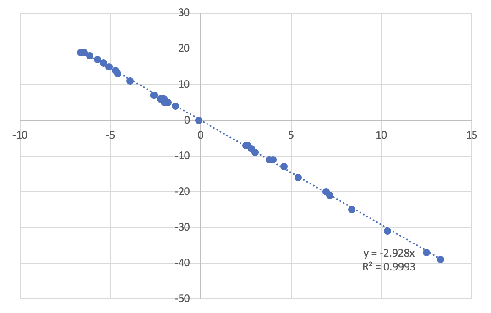

## 开发者注意事项

### 项目组织

- HTML/Svelte组件统一设置tab宽度为2，其它文件统一tab宽度为4，但都使用空格，不要使用tab字符。
- 换行符统一使用LF（`\n`），避免使用CR-LF（`\r\n`）。
- 不要提交IDE配置文件，因为它们不一定能跨平台。但是可以给一些示例，比如我们有`.vscode/settings.mac.json`和`.vscode/settings.windows-msvc.json`，可以视情况改编给自己使用。

### 代码风格（TypeScript）

- 标识符起名要使用尽可能正确的英语。
- 注释可选择使用尽可能正确的英语或者中文。注释有两种不同的用途：1. 让过于庞大的函数变得清晰；2. 解释比较难懂的算法或反直觉的逻辑。
- 每一个语句后面都要加分号（除了控制流语句如`if (...) {}`之外）。
  - 我们建议在`type ... = {...};`最后加分号
  - 但是`interface ... {...}`和`class ... {...}`里面不需要
- 如果你想要写一个TypeScript枚举，首先想想能不能用literal union解决。后者基本上能覆盖前者的所有使用场合，在性能上几乎没有差异，并且在调试和序列化上有优势。
- 使用switch讨论枚举或union取值情况的时候一定加上`default`块，并在其中使用`Debug.never`。
- 多使用`Debug.assert`和`Debug.early`。
  - 我们称下列情况为early return：一个函数被调用的时机不恰当，或者在不该调用的时候被调用了，导致什么也不需要做。一般来说，它不导致程序直接出现错误行为，但很可能意味着某些地方有潜在的逻辑问题。
  - 建议在early return的时候写`return Debug.early('reason');`。

### 代码风格（Rust）

- TODO
- 我不懂Rust，我只会瞎写。谁来教我

---

以下是一些笔记和参考资料

## The `wheel` Event Across Browsers and OS's

### Trackpad pinching

#### macOS / Safari

> X = `deltaY` (floating point), Y = `wheelDeltaY`



$Y = \text{trunc}(-3X)$

#### macOS / Chrome

`deltaY` looks like the same as Safari.

`wheelDeltaY` is always ±120.

#### Windows / Edge

No data yet (remote controller doesn't support trackpad pinching)

### Trackpad scrolling

#### macOS / Safari

> X = `delta*` (integer), Y = `wheelDelta*`


$Y = \text{trunc}(-3X)$

#### macOS / Chrome

The same

#### Windows / Edge

> X = `delta*`, Y = `wheelDelta*` (integer)


$X = Y / -1.2$

### Mouse wheel scrolling

#### macOS / Safari

`deltaY` is always ±120, for one wheel step (positive = down)

`wheelDeltaY` is `deltaY * -3`.

#### macOS / Chrome

The same

#### Windows / Edge

`deltaY` is always ±100, for one wheel step (positive = down)

`wheelDeltaY` is `deltaY * -1.2`.

### Summary

#### delta*

|Environment|Pinch|Trackpad scroll|Mouse scroll|
|--|--|--|--|
|macOS/Safari|float|integer|±120|
|macOS/Chrome|float|integer|±120|
|Windows/Edge|N/A|multiple of $5/6$|±100|

#### wheelDelta*

|Environment|Pinch|Trackpad scroll|Mouse scroll|
|--|--|--|--|
|macOS/Safari|trunc(-3*`delta*`)|trunc(-3*`delta*`)|-3*`delta*`|
|macOS/Chrome|±120|trunc(-3*`delta*`)|-3*`delta*`|
|Windows/Edge|N/A|-1.2*`delta*`|-1.2*`delta*`|

## Terribly Unintuitive Aspects of Svelte 5's Proxy-Based Reactivity

The `state_proxy_equality_mismatch` message reads: "Reactive `$state(...)` proxies and the values they proxy have different identities ..." But what does that mean? It means you just **can't** compare the reference equality between them. And note that objects and arrays are deeply reactive; consider:

```ts
let obj = {};
let obj_state = $state(obj);
let deep = $state({});

deep.value = obj;
console.log(deep.value == obj) // warning state_proxy_equality_mismatch; false
console.log($state.snapshot(deep.value) == obj) // false
console.log($state.snapshot(deep.value) == obj_state) // false
console.log($state.snapshot(deep.value) == $state.snapshot(obj_state)) // false

deep.value = obj_state;
console.log(deep.value == obj_state) // true
console.log($state.snapshot(deep.value) == obj) // false
console.log($state.snapshot(deep.value) == obj_state) // false
console.log($state.snapshot(deep.value) == $state.snapshot(obj_state)) // false
```

And `$state.snapshot` doesn't help here at all: it won't preserve the reference. Actually, it creates a clone of the object within the state (see [issue #15022](https://github.com/sveltejs/svelte/issues/15022)).

So, I repeat, you have **next to no way to** compare reference equality between a nonreactive object and 1) a reactive state, 2) a field in a deeply reactive object or 3) a member in a reactive array -- in roughly increasing order of unintuitiveness. Consider:

```js
let obj = {};
let reactive_array = $state([]);

reactive_array.push(obj);
console.log(reactive_array.indexOf(obj)); // state_proxy_equality_mismatch; -1
```

You can solve the problem only by making the object reactive first:

```js
let obj_state = $state(obj);
reactive_array.push(obj_state);
console.log(reactive_array.indexOf(obj_state)); // 1
```

... or immediately get the (now proxified) object from the array once it is pushed:

```js
reactive_array.push(obj);
obj = reactive_array.at(-1);
console.log(reactive_array.indexOf(obj)); // 2
```

... or use a SvelteSet instead, but that's not possible if item order matters.

It should really be better documented. I have a feeling that the Svelte documentations tend to focus on making everything look simple and easy to use, while unintuitive cases like this (which is likely where people will pull their hairs out in confusion) go without mention.

## Terribly Unintuitive Aspects of `$effect`

**"An effect only depends on the values that it read the last time it ran."**

Which means this -- the first version of the `hook` method in `PublicConfig` that I wrote -- won't work, because if when the effect runs for the first time `this.#initialized` isn't true, it won't run again anymore:

```typescript
hook<T>(track: () => T, action: (value: T) => void) {
    this.onInitialized(() => action(track()));

    $effect(() => {
        if (!this.#initialized) return;
        const value = track();
        untrack(() => action(value));
    });
}
```

As of writing (2025.4.23), there is a [pull request](https://github.com/sveltejs/svelte/pull/15069) to add a `$state.onchange` rune which removes this issue, and it looks like it will replace virtually all use cases of `$effect` in this project. I think it will be merged relatively soon.

## Terribly Unintuitive Aspects of `$state`s inside Objects

Consider:

```svelte
<script>
	let state = $state({o: 1})
	let obj = {x: state};
	$inspect(obj.x);
	$effect(() => {
		obj.x;
		console.log('obj.x changed');
	});
</script>
<button onclick={() => obj.x.o = 2}>test</button>
```

Clicking the button will **not** trigger the `$effect`. However, it **will** trigger `$inspect`!

If you want `$effect` to work correctly here, refer to the field as `$state.snapshot(obj.x)` instead;

I don't know the explanation for this yet.

## Template for Dialogs

```ts
<script lang="ts">
import DialogBase from '../DialogBase.svelte';
import { assert } from '../Basic';
import type { DialogHandler } from '../frontend/Dialogs';

import { _ } from 'svelte-i18n';

interface Props {
  handler: DialogHandler<void, /* return type here */>;
}
    
let {
  handler = $bindable(),
}: Props = $props();

let inner: DialogHandler<void> = {};
handler.showModal = async () => {
  assert(inner !== undefined);
  /* insert preparation here */
  let btn = await inner.showModal!();
  /* insert processing here */
  return /* result */;
}
</script>

<DialogBase handler={inner}>
  <!-- content here -->
</DialogBase>
```